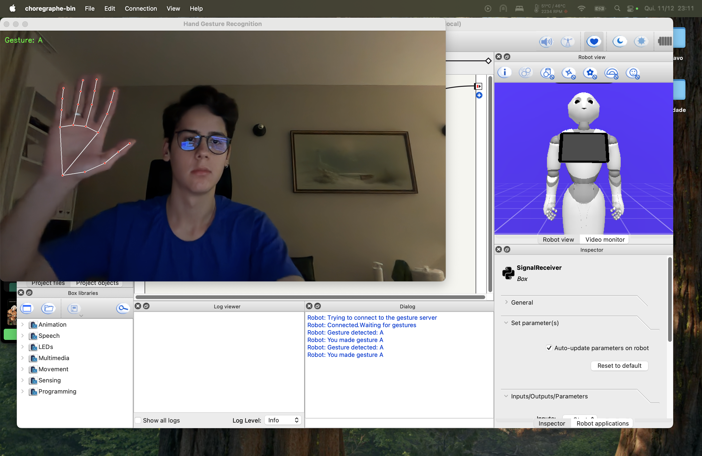
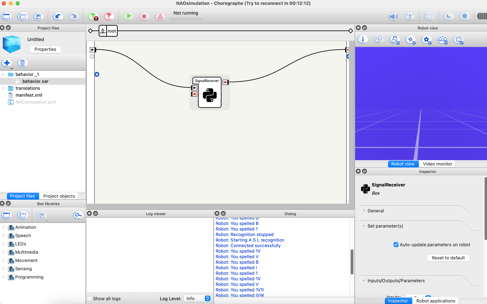

# 🖐️ ASL Hand Gesture Recognition with NAO (Choregraphe)

This project implements a **real-time ASL hand gesture recognition system** using **MediaPipe** and **OpenCV**, streaming recognized gestures to a **NAO robot (or NAO Simulation)**.
The NAO receives gestures continuously and reacts using **ALTextToSpeech**.

---

## Features

- Real-time hand tracking with **MediaPipe Hands**
- Simple ASL gesture classification 
- Continuous gesture streaming (no instant shutdown)
- TCP socket communication (Python ↔ NAO)
- Fully compatible with **Choregraphe (NAO Simulation)**

  


---

## System Architecture

```
Webcam
  ↓
asl_sign_recognition.py
(MediaPipe + OpenCV)
  ↓  TCP Socket (port 6000)
SignalReceiver (Choregraphe Python Box)
  ↓
NAO Text-To-Speech reaction
```

---

## Project Structure

```
ASL_SignLanguage/
│
├── sign_detection.py        # MediaPipe + gesture server (Python 3)
├── README.md                # Project documentation
├── SignalReceiver.py        # NAO Choregraphe Python box script

│
└── NAOsimulation/
    └── #Files from the Choregraphe software 

```

---

## Requirements

### Python (Computer Side)
- Python **3.9+**
- OpenCV
- MediaPipe

Install dependencies:

```bash
pip install opencv-python mediapipe
```

### NAO Side
- **Choregraphe 2.8.x**
- NAO Simulation **or** real NAO robot
- Python 2.7 (handled internally by Choregraphe)

---

## How to Run

### 1️⃣ Start the ASL Gesture Server

Run on your computer:

```bash
python asl_sign_recognition.py
```

Expected output (example):

```text
Gesture server: waiting for NAO...
Connected with: ('127.0.0.1', XXXXX)
=== Gesture recognition running ===
Move your hand and NAO will receive gestures continuously.
```

A webcam window will open:
- Show gestures
- Press **`q`** to stop

---

### 2️⃣ Open Choregraphe

1. Open **Choregraphe**
2. Create a **new behavior**
3. Add a **Python Box**
4. Paste the content of `SignalReceiver.py` into the box
5. Connect the flow:

   ```
   root → SignalReceiver → root
   ```

6. Make sure Choregraphe is connected to:
   - NAO Simulation running locally: `127.0.0.1`
   - Real NAO robot: use the robot IP



---

### 3️⃣ Run the Behavior

Click ▶ **Play** in Choregraphe.

You should hear:

```text
"Trying to connect to the gesture server"
"Connected. Waiting for gestures"
```

Then, for each received gesture, NAO will speak it.

---

## Continuous Mode (Important)

This setup is **continuous**:

- Gestures are streamed continuously
- NAO reacts each time a new gesture arrives
- The connection closes **only when**:
  - You press `q` in the webcam window, or
  - You stop the Choregraphe behavior, or
  - The socket is closed/disconnected


---

## Tested On

- macOS (Apple Silicon)
- Choregraphe 2.8.8
- NAO Simulation
- Python 3.x
- MediaPipe (CPU backend)
---

## Future Improvements
	•	ML-based gesture classification (as of right now, the accuracy is still limited with MediaPipe)
  •	Gesture to start/finish sentences
  •	Extra animations on NAO   
