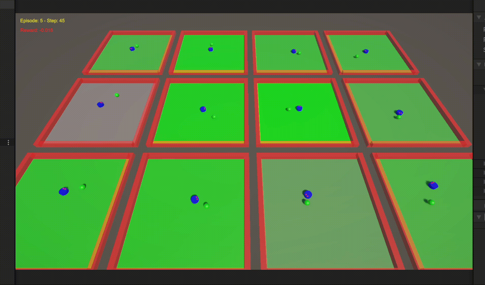

# TrackBot – Reinforcement Learning Environment (Unity + ML-Agents)

TrackBot is a reinforcement learning project built using **Unity** and **Unity ML-Agents**, where a simple autonomous agent learns to **reach a target sphere** using only **forward motion** and **discrete left/right rotations**.  
The environment was designed as a minimal yet pedagogically rich RL scenario, ideal for understanding **observations**, **reward shaping**, **agent locomotion**, and **multi-environment parallel training**.

<p align="center">
  
</p>

---

## Project Summary

The TrackBot agent is placed at the center of a square arena, and a goal is randomly positioned at a variable distance and angle.  
At each decision step, the agent can choose between:

1. **Move Forward**  
2. **Rotate Left**  
3. **Rotate Right**  
4. **Do Nothing** (default)

This simple action space forces the agent to learn **steering** and **navigation strategies** while respecting natural movement constraints — it cannot move backward or strafe.

---

## Core Mechanics

### Observations  
Implemented in `CollectObservations()` inside **TrackBot.cs**:

- Normalized goal position (x, z)  
- Normalized agent position (x, z)  
- Normalized agent orientation (yaw ∈ [-1, 1])  

This gives the neural network a compact, meaningful representation of the environment:

```csharp
sensor.AddObservation(goalPosX_normalized);
sensor.AddObservation(goalPosZ_normalized);
sensor.AddObservation(trackBotPosX_normalized);
sensor.AddObservation(trackBotPosZ_normalized);
sensor.AddObservation(trackBotRotation_normalized);
```

---

### Actions  
Implemented in `MoveAgent()`:

| Action | Meaning |
|--------|---------|
| 0 | Do Nothing |
| 1 | Move Forward |
| 2 | Turn Left |
| 3 | Turn Right |

The movement is continuous and physics-based:

```csharp
case 1:
    transform.position += transform.forward * _moveSpeed * Time.deltaTime;
    break;
case 2:
    transform.Rotate(0f, -_rotationSpeed * Time.deltaTime, 0f);
    break;
case 3:
    transform.Rotate(0f, _rotationSpeed * Time.deltaTime, 0f);
    break;
```

---

## Reward Structure

Reward shaping is one of the most educational parts of TrackBot:

| Situation | Reward |
|----------|--------|
| Reach Goal | **+1.0** |
| Each Step | Small negative reward (`-2f / MaxStep`) |
| Collision with Wall | -0.05 on enter, -0.01 per frame |
| Episode Failure (Time-out) | Implicit negative reward |

The agent quickly learns that:

- Wandering aimlessly is punished  
- Touching the wall is bad  
- Reaching goal as fast as possible is ideal  

---

## Episode Management & Environment Reset

When an episode begins (`OnEpisodeBegin()`), TrackBot:

1. Resets to the center of the arena  
2. Randomizes angle and distance of goal  
3. Flashes the ground **green** or **red** depending on previous performance  
4. Resets cumulative reward and color indicators  

The flash animation is handled via a coroutine:

```csharp
_flashGroundCoroutine = StartCoroutine(FlashGround(flashColor, 3.0f));
```

This provides intuitive **visual feedback** during training.

---

## Training Configuration (PPO – Proximal Policy Optimization)

The training configuration is defined in `track_config.yaml`:

```yaml
trainer_type: ppo
hidden_units: 128
num_layers: 2
gamma: 0.99
max_steps: 1000000
batch_size: 512
buffer_size: 10240
learning_rate: 0.0003
```

These settings produce stable learning and smooth convergence.

---

## GUI & Debug Overlay

Real-time training feedback is handled by **GUI_TrackBot.cs**.

Displayed on screen:

- **Current Episode**
- **Step Count**
- **Cumulative Reward**, color-coded:
  - 🟢 Green for positive reward
  - 🔴 Red for negative reward
  - 🟡 Yellow labels for general info

Example:

```csharp
string debugEpisode = "Episode: " + _trackBotAgent.CurrentEpisode + " - Step: " + _trackBotAgent.StepCount;
string debugReward = "Reward: " + _trackBotAgent.CumulativeReward;
```

This helped immensely in diagnosing agent behavior during development.

---

## Parallel Training Environments

TrackBot supports **multiple simultaneous environments** in a grid layout, drastically speeding up training by increasing data throughput.

Advantages:

- More diverse experiences per minute  
- Faster convergence  
- More stable PPO updates  

This is visible in the screenshot with 12 arenas running in parallel.

---

## Project Structure

```text
TrackBot/
│
├── Assets/
│   ├── ML-Agents/
│   ├── Scripts/
│   │   ├── TrackBot.cs
│   │   ├── GUI_TrackBot.cs
│   ├── Prefabs/
│   ├── Models/
│   ├── Materials/
│   └── Scenes/
│       └── SampleScene.unity
│
├── track_config.yaml
└── README.md  (this file)
```

---

## Requirements

- Unity 2022 LTS  
- ML-Agents 3.0+  
- Python 3.10 (for training)  

---

## ▶Training the Agent

Run from terminal inside your Unity project:

```bash
mlagents-learn track_config.yaml --run-id=TrackBotRun1
```

Then press **Play** in Unity.  
Training will start automatically.


